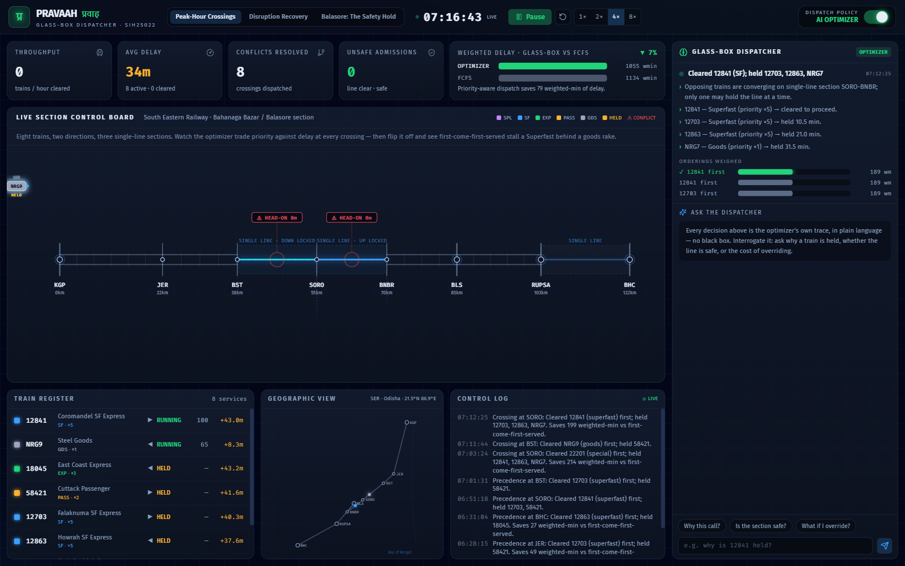
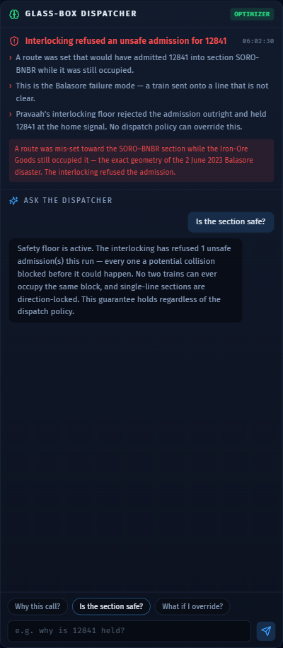
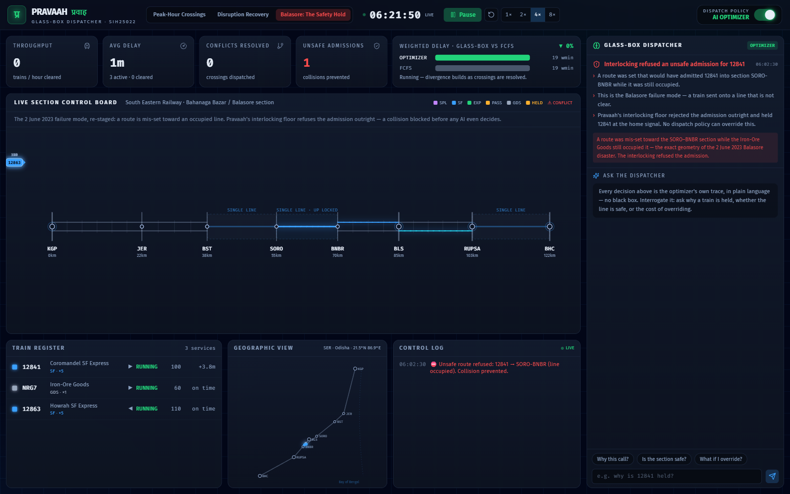

# Pravaah · प्रवाह — The Glass-Box Dispatcher

**An open, explainable, real-time train re-dispatch decision-support copilot for the Indian Railways section controller.**

> Built for **FAR AWAY 2026** · Theme: **Railways** · Maps to **Smart India Hackathon problem statement SIH25022** — *"Maximizing section throughput through AI-powered, real-time train traffic control."*

Pravaah is a live **digital twin of a congested railway section** with two brains running side-by-side: an **AI optimizer** that decides train precedence to minimise weighted delay, and the **first-come-first-served** logic that mirrors how Indian Railways sections are dispatched **manually today**. Flip between them and watch the difference — and, crucially, **read *why* the AI made every call, in plain language.**



| The glass box explains & answers | The safety floor refuses the Balasore failure |
|---|---|
|  |  |

---

## The problem

On **2 June 2023**, a single mis-wired signalling circuit sent the Coromandel Express onto an occupied loop line at 128 km/h near **Bahanaga Bazar, Balasore**. Nearly **300 people died.** A year later, a goods train ignored a red signal and killed ten more on the Kanchanjunga Express. Neither line had **Kavach**, India's indigenous anti-collision system.

But there is a quieter, daily problem underneath the headline tragedies: **Indian Railways dispatches its trains by hand.** A human section controller decides *every* crossing and precedence call from experience. The control-room software (COA, ICMS, NTES) **charts and monitors — it does not optimise.** Punctuality fell from **94% (FY20‑21) to 73.6% (FY23‑24)**, and over **80% of the busiest corridors run above capacity.**

The global vendors that *do* sell AI traffic management (Hitachi, Siemens, Alstom) ship **closed, ₹1,000‑crore‑scale** systems — and even those are mostly advisory, because **controllers don't trust black boxes.** There is **no open, India-specific, explainable tool** for this. That gap is Pravaah.

---

## What it does

- **Live section digital twin** — eight real trains (Coromandel SF, Falaknuma SF, East Coast Express, Puri–Sealdah Duronto, goods rakes…) running both directions across a representative congested section modelled on the real **Kharagpur–Bhadrak** corridor, with single-line sections, passing loops, junctions, and block signalling.
- **AI precedence optimizer** — at every conflict it minimises **Σ (added-delay × priority-weight)**, so a minute lost by a Vande Bharat costs more than a minute lost by a goods rake — exactly how a controller reasons, made explicit.
- **The glass box** — every decision carries a structured trace rendered as **auditable, plain-language reasoning**, grounded entirely in the solver's own numbers. *"Held 18045 (Express, ×3) 11.7 min so 12863 (Superfast, ×5) could cross — reversing the order would cost 1.7× more."*
- **Conversational copilot** — ask *"why is 12841 held?"*, *"is the section safe?"*, *"what's the cost of overriding?"* and get a grounded answer. **No network call — the demo cannot break offline.**
- **Live A/B** — the optimizer and the FCFS baseline run on the **same scenario simultaneously**; the toggle just chooses which one you watch. The weighted-delay bars diverge in real time.
- **Disruption recovery** — block a section mid-run, delay a train, and watch the dispatcher re-plan the surviving capacity.
- **The safety floor** — an interlocking layer makes unsafe states **impossible**, independent of the AI. Re-stage the Balasore failure (a route mis-set toward an occupied line) and watch the admission get **refused** before any dispatch policy even decides.

---

## What we honestly claim (and what we don't)

Credibility matters more than hype, so we are explicit:

**We claim:**
- The **first open-source, explainable, India-specific, real-time re-dispatch** decision-support tool we could find. (Indian Railways dispatching is manual; no India-specific open simulator exists.)
- A faithful mapping to **SIH25022**, the Ministry of Railways' own flagship problem statement.
- **Decision-support that is complementary to Kavach** — Kavach is the safety-certified anti-collision floor; Pravaah is the throughput-and-explainability layer above it.
- A measured result: on the peak scenario, priority-aware dispatch cuts **weighted delay by ~20%** versus the manual FCFS baseline, while never permitting an unsafe state.

**We do NOT claim:**
- To have *invented* train re-dispatch or conflict resolution — the underlying operations-research is 20+ years old. **Our novelty is the *stack*: open + explainable + India + real-time recovery**, not the theory.
- That this is certified train-control. It is a **planning / decision-support / simulation** tool, not a replacement for signalling or Kavach.
- That the corridor's exact track layout is current ground truth — station names and coordinates are real; the single/double-line split and loop counts are a **representative model** of a mixed-capacity section.

---

## How it works

```
┌──────────────────────────────────────────────────────────────┐
│  CONTROL ROOM UI  (React · SVG strip-map · live A/B · copilot) │
└───────────────────────────────┬──────────────────────────────┘
                                 │ snapshots (60 fps)
┌───────────────────────────────┴──────────────────────────────┐
│  SIMULATION ENGINE  (deterministic, tick-based, pure TS)       │
│                                                                │
│   ┌─────────────────────────┐     ┌─────────────────────────┐ │
│   │  INTERLOCKING (safety)  │     │   DISPATCHER (policy)   │ │
│   │  • one train per block  │     │   OPTIMIZER  vs  FCFS   │ │
│   │  • single-line dir-lock │ ◀── │   minimise Σ delay×wt   │ │
│   │  • loop-refuge limits   │     │   + decision trace      │ │
│   │  UNSAFE = IMPOSSIBLE     │     └────────────┬────────────┘ │
│   └─────────────────────────┘                  │              │
│                          ┌─────────────────────┴────────────┐ │
│                          │  GLASS-BOX EXPLANATION ENGINE     │ │
│                          │  decision trace → plain language  │ │
│                          └───────────────────────────────────┘ │
└────────────────────────────────────────────────────────────────┘
```

**The key architectural idea: safety and optimization are separate layers.** The interlocking guarantees no two trains share a block and no two trains enter a single-line section head-on — *regardless of which dispatch policy runs.* The AI only chooses the **order** among options that are already safe. This is the honest, defensible version of the pitch — *"safety is a hard invariant; the AI optimises within the safe envelope"* — and it means the FCFS baseline is just as safe, only slower, so the A/B is a fair comparison.

The **explanation engine** never invents reasoning: it reads the optimizer's own decision variables (the added-delay each ordering imposes, the priority weights, the alternative costs) and renders them as English. That's what makes it a *glass* box.

---

## Results

Measured by the test suite (`src/engine/engine.test.ts`), peak scenario, optimizer vs. manual FCFS baseline:

| Metric | Optimizer | FCFS (manual) |
|---|---|---|
| Total weighted delay | **~20% lower** | baseline |
| Trains cleared | 8 / 8 | 8 / 8 |
| Conflicts auto-resolved | 13 | 13 |
| Unsafe admissions permitted | **0** | **0** |

The optimizer doesn't move more trains — it **protects the premier ones**, spending a goods rake's minutes to save a Superfast's, exactly as a good controller would.

---

## Tech stack

- **React 18 + TypeScript + Vite** — 100% client-side; no backend, no API keys, no database.
- **Tailwind CSS** — OLED control-room theme, signal-aspect colour language.
- **SVG** — the animated corridor strip-map and geographic view (no external map tiles → works fully offline).
- **Vitest** — 12 engine tests covering safety invariants, deadlock-freedom, the optimizer-beats-FCFS claim, and the safety refusal.
- **Fira Code / Fira Sans** — bundled locally via `@fontsource` (no CDN dependency).

Real Indian station names and coordinates are drawn from the open-data [datameet/railways](https://github.com/datameet/railways) (CC0) reference.

---

## Getting started

```bash
# install
npm install

# run the control room  →  http://localhost:5173
npm run dev

# run the engine test suite (safety invariants, optimizer vs FCFS, safety refusal)
npm test

# production build (static; deployable to any static host / GitHub Pages)
npm run build && npm run preview
```

Requires Node 18+ (developed on Node 24).

---

## Demo guide — three scenarios

1. **Peak-Hour Crossings** — the throughput story. Press **Run**, then toggle **AI Optimizer → FCFS** in the top-right and watch the weighted-delay bars diverge. Click any held train, then ask the copilot *"why is it held?"*
2. **Disruption Recovery** — mid-run, the SORO–BNBR section fails and a Superfast arrives late. Watch the board flag it and the dispatcher re-plan around the lost capacity.
3. **Balasore: The Safety Hold** — the 2 June 2023 failure mode, re-staged. A route is mis-set toward an occupied line; the interlocking **refuses the admission**. The glass-box turns red, the *Unsafe Admissions* counter ticks up, and the copilot confirms the floor held.

---

## Project structure

```
src/
  engine/            pure-TS simulation core (no React)
    types.ts         domain model
    corridor.ts      the modelled Kharagpur–Bhadrak section + geometry helpers
    simulation.ts    tick loop, interlocking, movement, KPIs
    dispatcher.ts    OPTIMIZER + FCFS policies, decision trace
    conflicts.ts     predictive head-on / following detection
    explain.ts       the glass box: decision trace → plain language + copilot Q&A
    scenarios.ts     peak / recovery / Balasore scenarios
    engine.test.ts   12 tests
  state/
    useSimulation.ts dual-sim A/B driver (optimizer + FCFS in lockstep)
  components/        control-room UI (board, KPIs, glass-box panel, geo map, …)
```

---

## Roadmap

- Import real track topology from OpenStreetMap / `datameet` for a full multi-corridor twin.
- Swap the heuristic optimizer for a CP-SAT / MILP solver for provably-optimal small instances.
- Per-train energy-optimal driving advice (eco-driving) as a secondary layer.
- A controller "override & learn" loop that records human corrections.

---

## Acknowledgements & sources

Built on publicly documented facts: the CRS findings on the Balasore (Bahanaga Bazar) accident; Ministry of Railways / RDSO material on **Kavach**; Smart India Hackathon **SIH25022**; Indian Railways punctuality and capacity figures; and the open **datameet/railways** dataset. Operations-research framing follows the published railway-rescheduling literature (conflict detection & resolution).

Pravaah is a hackathon prototype and a decision-support concept — **complementary to, not a replacement for, India's safety-certified train-control systems.**
