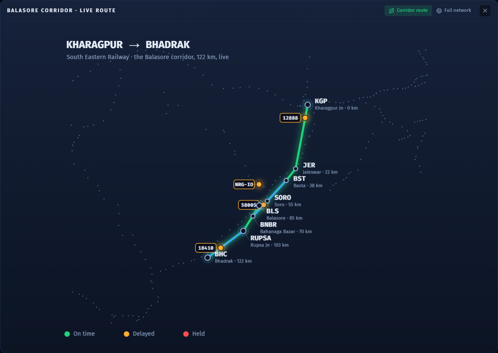

# Pravaah (प्रवाह) — The Glass-Box Dispatcher

An open, explainable AI co-pilot for the person who decides which train waits at each crossing: the Indian Railways section controller.

**Live demo:** https://garvitsurana271.github.io/pravaah/ (runs entirely in the browser, press "Guided Demo" for a 60-second tour)

Built for FAR AWAY 2026, Railways theme. It answers the Ministry of Railways' own Smart India Hackathon problem statement SIH25022, "Maximizing section throughput through AI-powered, real-time train traffic control."


## The problem

On 2 June 2023, a wrongly-wired signalling circuit sent the Coromandel Express onto an occupied loop line at 128 km/h near Bahanaga Bazar in Balasore. Close to 300 people died. The line had no Kavach, India's anti-collision system.

Underneath the headline tragedies there is a quieter, daily problem. Indian Railways still dispatches its trains by hand. A human section controller decides every crossing and every precedence call from experience. The control-room software (COA, ICMS, NTES) draws charts and shows where the trains are. It does not make the decision. Over the same years, punctuality fell from 94% to about 74%, and most of the busiest corridors now run above their rated capacity.

The companies that do sell AI traffic management (Hitachi, Siemens, Alstom) ship closed systems that cost upward of a thousand crore, and even those are mostly advisory, because controllers do not trust a system that cannot explain itself. There is no open, India-specific, explainable tool for this. That gap is what Pravaah fills.

## What it does

Open the live link and you are looking at a real, congested stretch of the South Eastern Railway near Balasore, with real trains running on it.

- **Two dispatchers, side by side.** An AI optimizer that sets precedence to keep total delay down, and the first-come-first-served logic that mirrors how it is actually done today. Flip between them with one toggle and watch the delay numbers move.
- **It explains itself.** Every decision comes with a short, plain reason built from the optimizer's own numbers, for example: "Held the Express 11 minutes so the Superfast could cross, because reversing that would cost 1.7 times more delay."
- **You can question it.** Ask "why is 12801 held," "is the section safe," or "what would an override cost," and it answers from the same decision trace. No network call, so the demo cannot break.
- **It cannot cause a collision.** A separate interlocking layer makes unsafe states impossible, no matter what the AI does. Run the "Balasore" scenario and watch it refuse a route set toward an occupied line.
- **It recovers from disruption.** Block a section mid-run and the dispatcher re-plans around the lost capacity.

| The glass-box explains and answers | The safety floor refuses the Balasore route |
|---|---|
|  |  |

## How real is the data

- The national map is **8,697 real Indian stations** with real coordinates, from the open [datameet/railways](https://github.com/datameet/railways) dataset (CC0).
- The trains on the board are **real services that run this corridor** (Purushottam SF Express, Sri Jagannath Express, Puri-Howrah Garib Rath, and others), pulled from the open railway timetable. We arranged their directions and gaps into one peak window so they interact on screen, and the two goods rakes are synthetic because freight runs no public timetable.
- The live movement is a deterministic **simulation**. We are explicit about this: Indian Railways has no open real-time position feed, so nobody can do live positions without faking them. A simulation is also the only way to re-stage the exact 2023 failure and run a fair AI-versus-manual comparison. The engine is built to sit on top of a real feed the day a railway grants access.



*Zoom into the corridor from the national view: the real Kharagpur–Bhadrak section on the map of eastern India, single-line crossings marked, live trains coloured by status.*

## The result

On the peak scenario, the AI optimizer against the manual first-come-first-served baseline:

- About **25% less weighted delay** (a premier train's minute counts for more, the way a controller already reasons).
- In human terms, roughly **1.46 lakh passenger-minutes saved** over the peak hour, and premier trains (Superfast and above) running **33% less late** — about 27 minutes sooner each — because the AI protects them at every crossing.
- The same number of trains cleared. The optimizer does not move more trains, it protects the important ones.
- **Zero** unsafe states permitted, under either policy.

## How it works

Two layers, kept deliberately separate.

1. **Interlocking (safety).** One train per block, single-line sections locked to one direction, loops with limited capacity. Unsafe states are impossible here, in code, regardless of which dispatcher is running. This is why the manual baseline is just as safe, only slower, which makes the comparison fair.
2. **Dispatcher (policy).** This only chooses the order among options that are already safe. The optimizer minimises priority-weighted delay with a short look-ahead. The baseline serves in arrival order. Either way it writes down a full trace of what it considered and why.

The explanation engine never invents anything. It reads the optimizer's actual decision variables (the delay each ordering would cost, the priority weights, the alternative it rejected) and turns them into English. That is what makes it a glass box rather than a black box.

## Running it

```bash
npm install
npm run dev        # http://localhost:5173
npm test           # 12 tests: safety invariants, no deadlock, AI beats manual, the safety refusal
npm run build      # static build, deployable anywhere
```

Node 18 or newer.

## What we claim, and what we do not

We claim this is, as far as we found, the first open, explainable, India-specific, real-time re-dispatch tool. It maps to SIH25022. It is decision-support that sits alongside Kavach, not a replacement for it: Kavach is the safety-certified anti-collision layer, Pravaah is the throughput and explainability layer above it.

We do not claim to have invented train re-dispatch or conflict resolution. The underlying operations research is decades old. Our contribution is the combination: open, explainable, India-specific, with safety as a hard floor. This is a prototype and a decision-support concept, not certified train control.

## Built with

React, TypeScript, Vite, Tailwind, and hand-drawn SVG. No backend, no API keys, fully offline once loaded. Fonts are bundled so it works with no network. Station and timetable data from datameet (CC0). Engine tested with Vitest.
